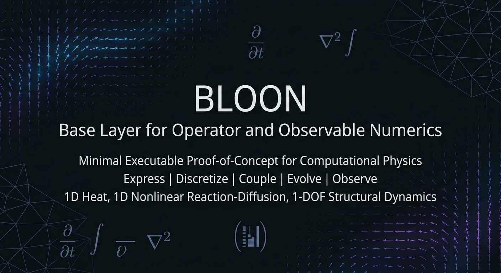
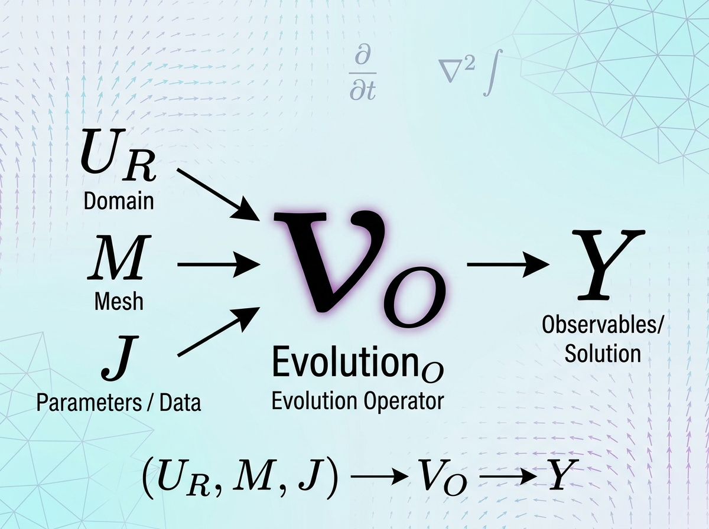
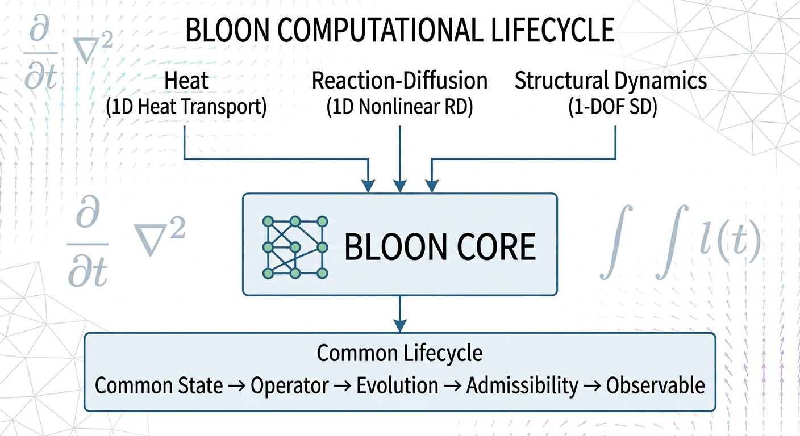
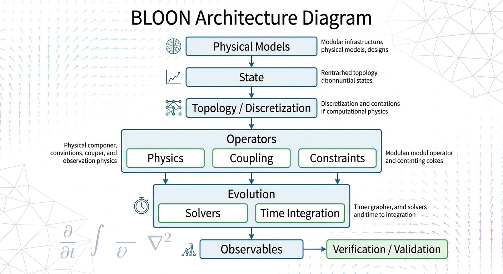

# BLOON

## Base Layer for Operator and Observable Numerics

A minimal executable proof-of-concept for a generalized computational
infrastructure for expressing, discretizing, coupling, evolving, and
observing physical systems.



---

## Overview

BLOON is a computational infrastructure concept designed to provide a
common computational representation for different mathematical models
of evolving physical systems.

BLOON does not propose a unified physical theory, nor does it attempt
to replace domain-specific numerical methods.

Instead, it provides a common computational structure around:

- State
- Topology and discretization
- Operators
- Constraints
- Evolution
- Observables
- Verification and validation

The central idea is:

> Abstraction reduces software fragmentation; it does not eliminate
> mathematical complexity.

---

## Computational Abstraction



BLOON separates the representation of a physical model from the
computational mechanisms used to evolve its discrete state.

A simplified computational view is:

$$
\mathbf{U}
\;\xrightarrow{\mathcal{R},\,\mathcal{M},\,\mathcal{J}}\;
\text{Evolution}
\;\xrightarrow{\mathcal{O}}\;
\mathbf{Y}
$$

where:

- $\mathbf{U}$ is the computational state,
- $\mathcal{R}$ represents residual or spatial operators,
- $\mathcal{M}$ represents storage/capacity operators,
- $\mathcal{J}$ represents Jacobian information,
- $\mathcal{O}$ maps computational states to observables,
- $\mathbf{Y}$ represents quantities of interest.

---

## Computational Lifecycle



The current prototype demonstrates that physically different models
can be executed through the same computational lifecycle.

```text
Physical Model
      ↓
    State
      ↓
Topology / Discretization
      ↓
   Operators
      ↓
   Evolution
      ↓
Admissibility
      ↓
 Observables
      ↓
Verification
```

---

## Architecture



The BLOON infrastructure separates computational concerns into
interacting layers.

```text
                         BLOON
                           │
              ┌────────────┴────────────┐
              │                         │
            STATE                   TOPOLOGY
              │                         │
              └────────────┬────────────┘
                           │
                    DISCRETIZATION
                           │
                       OPERATORS
                           │
             ┌─────────────┼─────────────┐
             │             │             │
          PHYSICS       COUPLING     CONSTRAINTS
             │             │             │
             └─────────────┼─────────────┘
                           │
                    ADMISSIBILITY
                           │
                       EVOLUTION
                           │
                 ┌─────────┴─────────┐
                 │                   │
              SOLVERS          TIME INTEGRATION
                 │                   │
                 └─────────┬─────────┘
                           │
                      OBSERVABLES
                           │
                    VERIFICATION
```

The architecture is intentionally modular. Physics-specific
implementations provide operators, while the computational
infrastructure provides the common execution lifecycle.

---

## Current Demonstrations

Three different models are currently demonstrated:

- 1D Heat Transport
- 1D Nonlinear Reaction-Diffusion
- 1-DOF Structural Dynamics

### 1. Heat Transport

A one-dimensional heat equation is discretized using a finite
difference spatial operator and evolved using Backward Euler.

### 2. Nonlinear Reaction-Diffusion

A nonlinear reaction-diffusion model is implemented using the same
state/operator/evolution infrastructure.

### 3. Structural Dynamics

A one-degree-of-freedom structural oscillator is represented as a
first-order state-space system.

The observed energy reduction demonstrates numerical dissipation
associated with the selected Backward Euler time integration scheme.
It should not be interpreted as physical dissipation in the undamped
oscillator.

---

## Run the Demonstrations

From the project root:

```powershell
python run_examples.py
```

This executes all demonstration models followed by the automated
verification suite.

### Example Output

```text
======================================================================
  Heat Transport
======================================================================
=== Executable Demo: 1D Heat Transport ===
Initial Max Temp: 1.000000
Final Max Temp  : 0.390259
Admissibility   : PASS

======================================================================
  Reaction-Diffusion
======================================================================
=== BLOON Executable Demo: 1D Reaction-Diffusion ===
Initial Total Mass: 0.088623
Final Total Mass  : 0.101678
Positivity Check  : PASS

The change in integrated mass is expected because the model contains
a reaction/source term.

======================================================================
  Structural Dynamics
======================================================================
=== BLOON Executable Demo: Structural Dynamics (1-DOF) ===
Initial Energy: 50.000000
Final Energy  : 47.564439

======================================================================
  Pytest Verification Suite
======================================================================
....                                                                 [100%]
4 passed in 0.17s

======================================================================
  BLOON EXAMPLE + VERIFICATION SUITE: PASSED
======================================================================
```

---

## Verification

The prototype includes automated tests for:

- Heat equation convergence
- Reaction-diffusion positivity
- Structural dynamics against an analytical solution
- Reuse of the same computational pipeline across multiple physics
  models

Run the test suite directly with:

```powershell
pytest -q
```

Current verification status:

```text
4 passed
```

---

## Design Principle

BLOON is based on a simple architectural proposition:

> A common computational infrastructure can represent and evolve
> different physical models without requiring the infrastructure
> itself to become a universal physical theory.

The abstraction is intended to provide a foundation for future
extensions involving more advanced discretizations, nonlinear
solvers, multiphysics coupling, sparse linear algebra, adaptive
methods, and high-performance computing.

These capabilities are future development directions and are not
claimed by the current prototype.

---

## Scope and Non-Claims

BLOON currently does not claim to be:

- a universal physics solver,
- a unified physical theory,
- an industrial-scale multiphysics platform,
- a production CFD or FEM package,
- a replacement for domain-specific numerical methods.

The current implementation is deliberately small and serves as an
executable proof-of-concept of the proposed computational abstraction.

---

## Status

**Prototype / Proof of Concept**

The current implementation demonstrates the computational architecture
through three physical models and an automated verification suite.

The project is intended to evolve incrementally from this foundation.

---

## References

1. Hughes, T. J. R. (2000). *The Finite Element Method: Linear Static and Dynamic Finite Element Analysis*. Dover Publications.

2. LeVeque, R. J. (2002). *Finite Volume Methods for Hyperbolic Problems*. Cambridge University Press.

3. Hesthaven, J. S., & Warburton, T. (2008). *Nodal Discontinuous Galerkin Methods: Algorithms, Analysis, and Applications*. Springer.

4. Hairer, E., & Wanner, G. (1996). *Solving Ordinary Differential Equations II: Stiff and Differential-Algebraic Problems*. Springer.

5. Oberkampf, W. L., & Roy, C. J. (2010). *Verification and Validation in Scientific Computing*. Cambridge University Press.

These references provide mathematical and numerical foundations for
the computational concepts explored by the BLOON prototype. They do
not constitute a claim that BLOON itself implements all methods
described in these references.

---

## License

License information will be added as the project matures.
